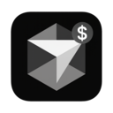

# CursorUsage

A macOS menu bar application that monitors and displays your Cursor AI usage statistics.



## Features

- Live display of Cursor AI usage metrics directly in your menu bar
- View detailed usage information including:
  - Premium request count and limits
  - Current usage costs
  - Usage limits and refresh dates
- Automatic data refresh every 30 minutes
- User authentication via Cursor session token
- Clean, native macOS menu bar interface

## Requirements

- macOS 15.0 or later
- An active Cursor account

## Installation

1. Download the latest release from the [Releases](https://github.com/Natxo09/CursorUsage/releases) page
2. Move the CursorUsage app to your Applications folder
3. Launch the application

## Setup and Authentication

When you first launch CursorUsage, you'll need to authenticate with your Cursor account:

1. Click on the CursorUsage icon in the menu bar
2. Click on the ⚙️ (Settings) button
3. Obtain your Cursor session token (instructions below)
4. Paste the token in the authentication field
5. Click "Validate" to authenticate

### How to find your Cursor session token

1. Log in to [cursor.com](https://cursor.com) in your browser
2. Open Developer Tools (F12 or Cmd+Option+I)
3. Go to Application/Storage > Cookies > cursor.com
4. Find "WorkosCursorSessionToken" and copy its value
5. Paste this value into the authentication field in CursorUsage settings

## Usage

Once authenticated, CursorUsage will display your current usage statistics in the menu bar:

- For accounts under the premium limit: Shows "used/limit" (e.g., "320/500")
- For accounts over the premium limit: Shows current billing amount (e.g., "$12.45")

Click on the menu bar icon to see detailed information including:
- Account email and subscription status
- Premium usage count and limit
- Current billing amount
- Usage limit and days until refresh

## Build from Source

### Prerequisites
- Xcode 15 or later
- Swift 5.9 or later
- macOS 15.0+ SDK

### Steps
1. Clone this repository
```bash
git clone https://github.com/Natxo09/CursorUsage.git
```

2. Open the project in Xcode
```bash
cd CursorUsage
open CursorUsage.xcodeproj
```

3. Build and run the application

## Privacy

CursorUsage only stores your Cursor session token locally on your device and does not share any data with third parties. All usage data is retrieved directly from Cursor's official APIs.

## License

This project is licensed under the MIT License - see the LICENSE file for details.

## Acknowledgments

- Built with SwiftUI
- Developed by Ignacio Palacio (Natxo)